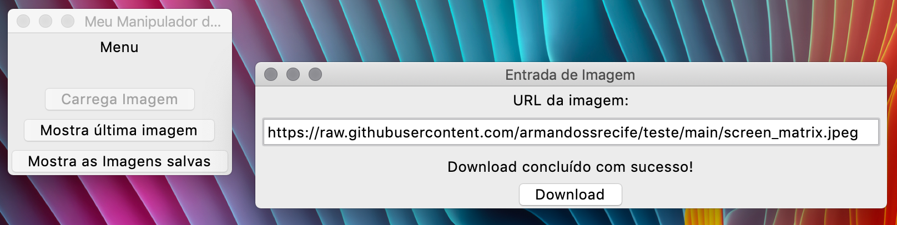
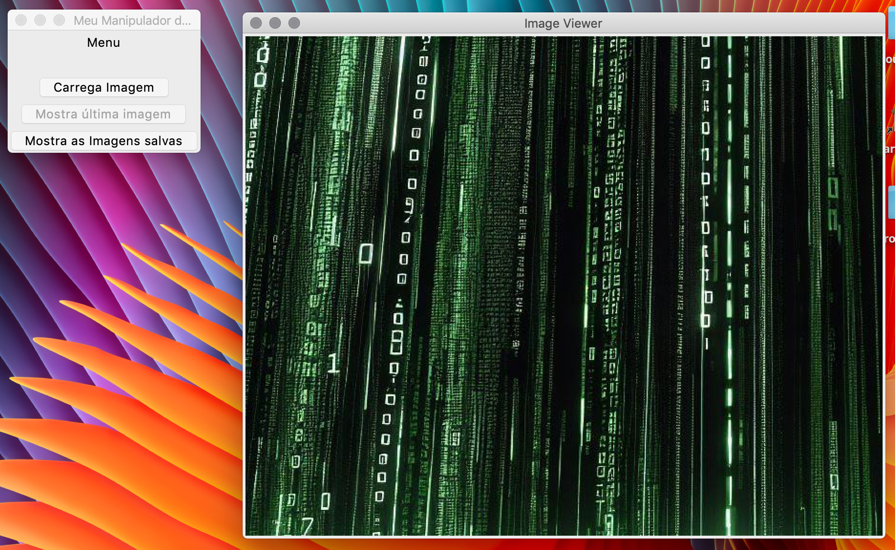
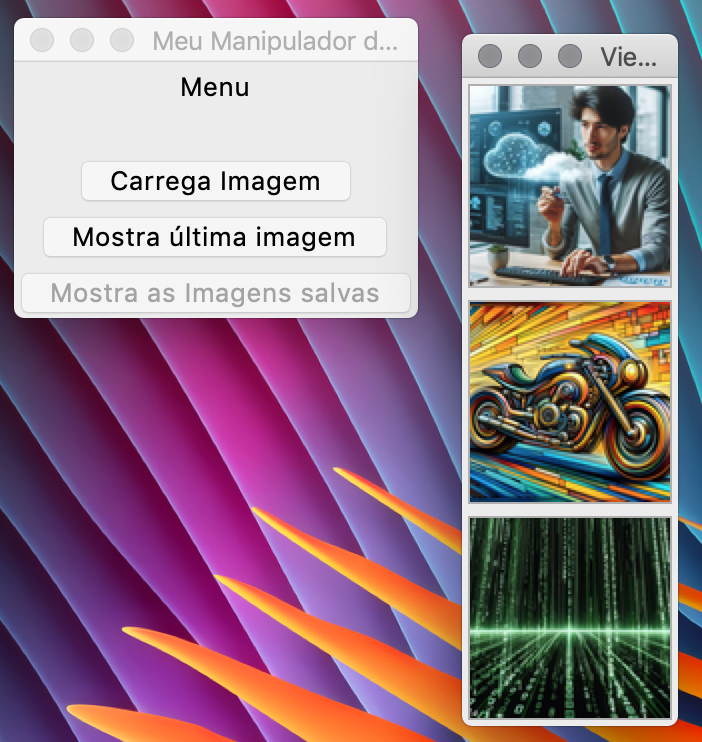

# My GUI Images

Aplicação desktop em Python e Tkinter para baixar, organizar e visualizar imagens.

## Funcionalidades

- Download de imagens por URL sem bloquear a interface gráfica.
- Validação do protocolo, da extensão, do `Content-Type` e do conteúdo da imagem.
- Suporte a arquivos JPG, JPEG, PNG, GIF, BMP e WebP.
- Limite de 25 MiB por download, verificado pelo cabeçalho e pelos bytes recebidos.
- Cancelamento do download quando a janela de entrada é fechada.
- Reserva atômica de nomes para impedir a sobrescrita de arquivos existentes.
- Gravação inicial em arquivo temporário `.part`; a imagem somente é publicada depois de
  ser completamente baixada e validada.
- Visualização da imagem mais recente e de todas as imagens salvas.
- Miniaturas com rolagem e redimensionamento usando
  `PIL.Image.Resampling.LANCZOS`.

As imagens são armazenadas no diretório `imagens/` localizado ao lado dos arquivos do
projeto. Esse caminho não depende do diretório a partir do qual o programa foi iniciado.

## Requisitos

- Python 3.13 ou superior.
- Tkinter disponível na instalação do Python.
- [uv](https://docs.astral.sh/uv/) — recomendado — ou `pip`.

As dependências Python são declaradas em `pyproject.toml` e fixadas em `uv.lock`:

- Pillow;
- Requests;
- tqdm.

## Instalação e execução com uv

Sincronize exatamente as versões registradas no arquivo de lock:

```bash
uv sync --locked
```

Execute a aplicação:

```bash
uv run python main.py
```

## Instalação e execução com pip

Crie e ative um ambiente virtual:

```bash
python3 -m venv .venv
source .venv/bin/activate
```

No Windows, use `.venv\Scripts\activate` para ativar o ambiente.

Instale o projeto e execute a aplicação:

```bash
python -m pip install .
python main.py
```

## Testes

Execute a suíte com:

```bash
uv run python -m unittest discover -v
```

Os testes cobrem:

- geração concorrente de nomes sem colisões;
- publicação da imagem somente após a validação;
- rejeição de downloads acima do limite;
- cancelamento e remoção de arquivos incompletos.

## Estrutura do projeto

```text
.
├── main.py                 # Ponto de entrada da aplicação
├── gui.py                  # Janelas e integração com Tkinter
├── entidades.py            # Utilitários, validação e download
├── imagens/                # Imagens salvas pela aplicação
├── tests/                  # Testes automatizados
├── docs/                   # Capturas de tela e documentação visual
├── pyproject.toml          # Metadados e dependências
└── uv.lock                 # Versões resolvidas das dependências
```

Mais informações sobre as classes estão em [detalhes.md](detalhes.md).

## Telas da aplicação

### Tela principal



### Visualização de imagem



### Lista de imagens



### Imagem selecionada


